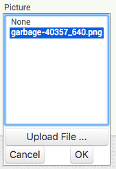
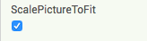
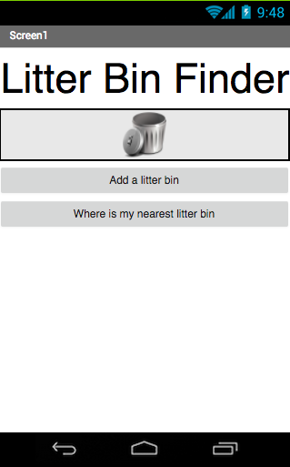
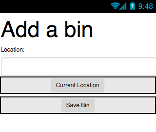
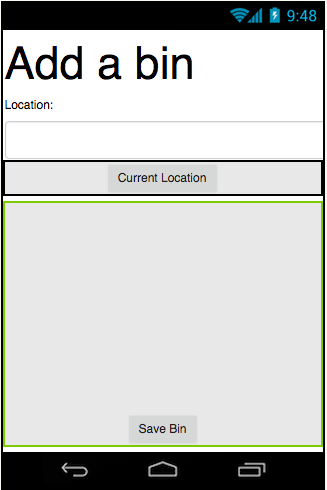

## Creating the layout

+ Create a new project in App Inventor and name it `LitterBinFinder`, or come up with a name of your own!

+ First you're going to set up a home screen. Add a label and two buttons to your app. Make the label say the name of the app, and set the texts of the buttons to "Add a litter bin" and "Where is my nearest litter bin".

Now I don’t know about you, but I think the title should be bigger!

+ Go to the label’s Properties and change the FontSize to something nice and large. I chose 40, but you could go bigger!

Now since you have that new, nice, large title, you can get rid of one at the top of the screen.

+ Click on the screen under **Components**, and in its Properties, un-check the **TitleVisible** checkbox.

+ Those buttons are a bit small too, so go to their Properties and change their widths to `Fill parent`.

+ Finally, let’s add an image. Find or draw a suitable image or use the one here: [dojo.soy/litterbin](http://dojo.soy/litterbin){:target="_blank}. 

+ Now get an Image component and drag it onto the screen. In its Properties, find **Picture**, then **Upload File**, and upload the image you want to use.

--- collapse ---
---
title: Centering something
---

Depending on the size of your image, it might be be cool if it was displayed in the centre of the screen. 

+ To do that you will need a HorizontalArrangement from **Layout**. Drag one onto the screen and move your Image into it.

+ Now click on **HorizontalArrangement** and go to its Properties. Set the Width to `Fill parent`, then find **AlignHorizontal** and switch it to `Center: 3`.

--- /collapse ---

--- collapse ---
---
title: My picture is bigger than the screen
---

If you're using a picture that's too big, no problem!

+ Click on the image and look at its Properties.

+ Check the box **ScalePictureToFit**. This will shrink the picture to fit the screen.

--- /collapse ---

+ Awesome! You’ve just finished the first screen. Here’s what mine looks like:

+ Now make another screen named "AddABin".

+ Like before, add a Label with the screen's title. Also add another Label saying "Location:", a TextBox, and two Buttons saying "Current Location" and "Save Bin".

+ Now try out some of your new skills. Give the TextBox a width of "Fill parent" and use two HorizontalArrangements to center both Buttons.

It might look better if the save button was at the very bottom.

+ Change the height of its HorizontalArrangment to `Fill parent` and then just set its **AlignVertical** property to `Bottom: 3`.

+ Awesome! You should have something like this:

+ Now you just need to add one more screen. Name it "ListOfBins".

+ This one is really simple: drag a ListView out and change its Height to `Fill parent`.

That's all your screens ready to go!
