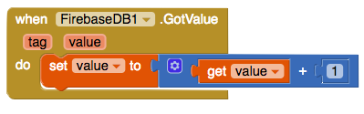

## Saving data to Firebase

To allow for all users of your app to see all the litter bins, you need to store the data online. To do this, App Inventor has a web database you can write values to and later get back.

+ Staying on the **AddABin** screen, go to the **Designer** view and drag a **FirebaseDB** (**Palette** > **Experimental**) component into your app. Don't worry if you get a popup message, just go ahead and click **OK**.

+ Back in the Blocks view, add a `call FirebaseDB.StoreValue` block.

--- collapse ---
---
title: What are tags and values?
---

You can see that the `StoreValue` block is asking for two values:
  + The **tag** is an unique identifier that you will use to retrieve the data later
  + The **value** is the data that you want to save

The important thing is that a **tag** has to be unique (i.e. it is only used once). You need to make sure that nobody ever reuses the same tag. If this were to happen, then the data with that tag would be lost!

To make sure this doesn't happen, you will tell Firebase to store a value `BinNumber` that you will keep adding to. This will then be your tag.

--- /collapse ---

+ Add a `call Firebase.GetValue` block to the `then` statement in the `when Save.Click` block.

+ Add a `text` block with `"BinNumber"` as the tag and a `0` block for the **ValueIfTagNotThere**:

--- collapse ---
---
title: Why is the value not returned?
---

Right now, your code asks Firebase for the current amount of bins. Firebase will look for this and once it finds the value, it will call another function, in this case `GotValue`.

This is known as an **asynchronous call** and means your app can keep running while it waits for Firebase!

--- /collapse ---

+ Once Firebase finds the value, it will run the `GotValue` function. So go ahead and add a `when Firebase.GotValue` block, so you can run some code when this happens.

+ Firstly you need to increment the amount of the bins (as you are adding a new one). Hover over `value` and drag out a `set value to` block. Put this into the `when Firebase.GotValue` block. Also take out a `get value` block.

+ From Math, drag out the `+` block along with a `0` block. Set the `0` block to `1`.

+ Place the `get value` and `0` blocks into the `+` block, and attach it to the `set value to` block.

+ Now you have your a unique tag: you have just increased the `"BinNumber"` by `1`. The next time someone adds a bin, they will also automatically increase the `"BinNumber"`, so your **tag** will always stay unique!

+ Drag the `call FirebaseDB.StoreValue` block you added earlier to below the `set value to` block:

This block tells the Firebase database to store the location (the address in the TextBox). When you want to find the address again, you can use its tag (its value of `"BinNumber"`).

+ Connect a `get value` block to the `tag` attachment, and a `TextBox.text` to the `value` attachment.

+ The only thing left to do is to change the amount of bins in Firebase. This code for this is exactly the same as the previous block, just with the tag and value changed. Try it yourself! It should go just below the previous `call Firebase.StoreValue` block.

--- hints ---

--- hint ---

+ The value you want to store is the new value for the number of bins.

+ Use the tag you defined earlier for getting and storing the current bin number.

--- /hint ---

--- hint ---

+ To update the bin number, you need `call FirebaseDB.StoreValue` with a `tag` of `"BinNumber"` and a `value` of `get value`. Here is what the code looks like:

--- /hint ---

--- /hints ---

+ Fantastic! Now you can add new bins to the app. Just add an `open another screen screenName` block and attach it to a `""` block. Type in `Screen1` here, so you can get back to the home screen.

Your `GotValue` code should look like this now:

